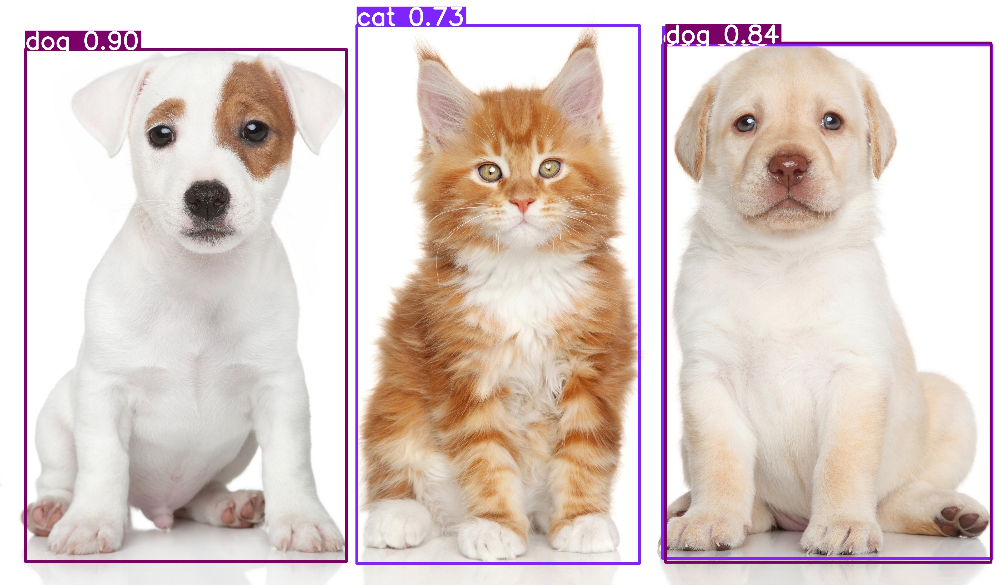
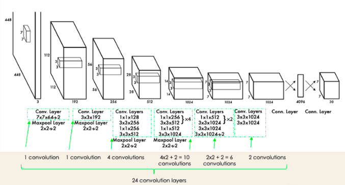

# Day 1 of Learning YOLO

## Object Detection
Object detection is a technique used in computer vision for the identification and localization of objects within an image or a video. It not only classifies objects within an image but also draws bounding boxes around the objects to indicate their positions.

## Example Image

## About YOLO
You Only Look Once (YOLO) is a state-of-the-art, real-time object detection algorithm introduced in 2015 by Joseph Redmon, Santosh Divvala, Ross Girshick, and Ali Farhadi in their famous research paper “You Only Look Once: Unified, Real-Time Object Detection”.

## YOLO Architecture

YOLO architecture is similar to GoogleNet. As illustrated below, it has overall 24 convolutional layers, four max-pooling layers, and two fully connected layers.

The architecture works as follows:

1. Resizes the input image into 448x448 before going through the convolutional network.
2. A 1x1 convolution is first applied to reduce the number of channels, which is then followed by a 3x3 convolution to generate a cuboidal output.
3. The activation function under the hood is ReLU, except for the final layer, which uses a linear activation function.
4. Some additional techniques, such as batch normalization and dropout, respectively regularize the model and prevent it from overfitting.
